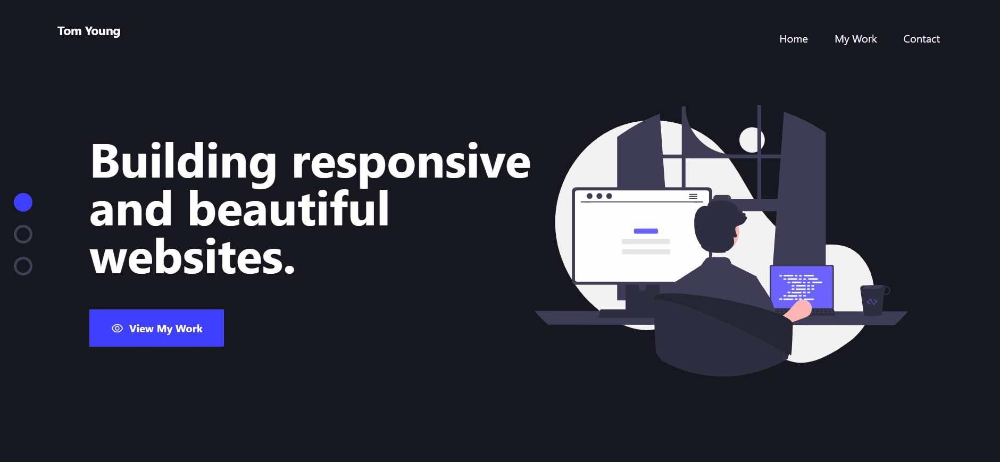

<h1 align="center">My Portfolio</h1>

This is version 1.0 of my portfolio, built with Next.js and styled with Tailwind CSS. It presents 4 of my other projects in a fully responsive website.

## Links 🌟

- Live site: [Try it out here 💻](https://tom-young-portfolio.vercel.app/ 'Live Site')

## Screenshots 📷

  

## Built With 🛠

- [Next.js](https://tom-young-portfolio.vercel.app/) - I used the [Next.js + Tailwind CSS Example](https://github.com/vercel/next.js/tree/4d4f3093019179b1928ec07c16f38882241c0375/examples/with-tailwindcss) code as a foundation to ensure correct setup.
- [Tailwind CSS (v3.0)](https://tailwindcss.com/)

## Future Updates 🎁

- [ ] Add CMS to manage projects
- [ ] Add email form to contact section

## Changelog

- **[1.0] 26/01/22 Deployment**: Site deployed to Vercel

## Author 🧑

**Tom Young**

- [Github Profile 👨‍💻](https://github.com/TheThomasY)
- [Email ✉](mailto:tomyoungdev@gmail.com?subject=Hi 'Hi!')
- [LinkedIn 💼](https://www.linkedin.com/in/tom-young5555/)
- [Dev.to 🖊](https://dev.to/thetomy)

Give a ⭐️ if you like this project!
